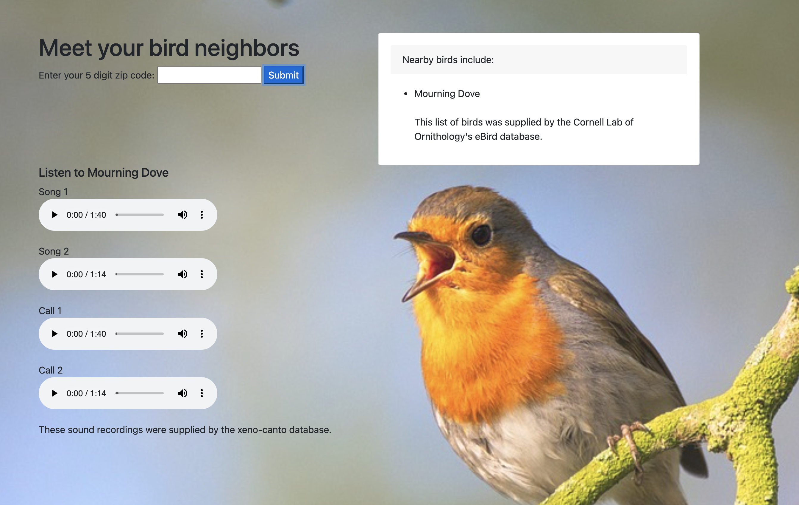
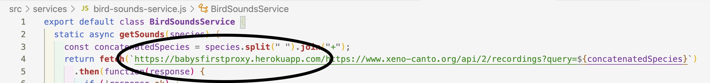

# Meet Your Bird Neighbors

#### _A web-based application which takes a zip code from the user and returns a recently sited local bird as well as recordings of that bird's songs and calls._

#### By **Alex Bertotto, Smita Raj, Tim Roth, Marni Sucher and Jessica Williams**

#### Table of Contents

1. [Preview](#preview)
2. [Technologies Used](#technologies)
3. [Description](#description)
4. [API Key Procurement](#api)
5. [Setup/Installation Requirements](#setup)
6. [Additional Setup/Installation Note for Windows Users](#windows)
7. [Known Bugs](#bugs)
8. [Future Stretch Goals](#goals)
9. [License](#license)
10. [Contact Information](#contact)

## Preview 

## Technologies Used 

* _Babel/core 7.6.4_
* _Babel/plugin-transform-modules-commonjs 7.6.0_
* _Bootstrap 4.5.0_
* _clean-webpack-plugin 3.0.0_
* _CORS-Anywhere_
* _CSS_
* _css-loader 3.2.0_
* _dotenv-webpack@2.0.0_
* _eBird API 2.0_
* _eslint 6.3.0_
* _eslint-loader 3.0.0_
* _file-loader 1.1.6_
* _Geocoding API_
* _gh-pages 3.2.3_
* _Heroku_
* _HTML5_
* _html-loader 0.5.5_
* _html-webpack-plugin 3.2.0_
* _JavaScript ES6_
* _Jest 24.9.0_
* _jQuery 3.5.1_
* _Node Package Manager 6.14.9_
* _popper.js 1.16.1_
* _style-loader 1.0.0_
* _webpack 4.39.3_
* _webpack-cli 3.3.8_
* _webpack-dev-server 3.11.2_
* _xeno-canto API 2.0_

## Description 

Birds are some of the most common wild animals with which human civilization intersects. Birds are found on every continent and inhabit all the places humans live: urban, suburban, and rural. Birds are not always easy to see or to see for long enough to get a good look. You're more likely to hear most birds than see them.

The Baader-Meinhof Phenomenon, also known as frequency illusion, explains that human brains reinforce recently acquired information by paying more attention to subsequent occurrences of, or references to, that newly acquired information. Applying this to the context of bird songs and calls we may say, becoming familiar with the songs and calls of your local birds will allow you to actually register and recognize those sounds when birds make them around you. The presence of those birds won't be more frequent (other than expected seasonal population changes of migratory species) but experientially you will become more aware of birds singing and calling around you.

Learning to recognize the songs and calls of your local birds with our application, Meet Your Bird Neighbors, will enhance your awareness of and appreciation for the world around you by tuning your attention to all the different bird species around you.

Enter a zip code into the application's user interface and click the 'submit' button. The application will return to you the most recent sighting of a local bird within a ten mile radius as well as recordings of that species' songs and calls. The most recent sighting is from Cornell Lab of Ornithology's [eBird database](https://ebird.org/home). The sound recordings are from the [xeno-canto database](https://www.xeno-canto.org/).

Listen to the recordings, become familiar with them and then listen as you go about your life. Enhance your connection to the natural world around you by meeting your bird neighbors.

## API Key Procurement 

Meet Your Bird Neighbors uses three Application Programming Interface, API, calls to return output to the user. The three APIs are the [Geocoding API](https://developers.google.com/maps/documentation/geocoding/start) from Google Enterprise API, [eBird API 2.0](https://documenter.getpostman.com/view/664302/S1ENwy59?version=latest) from Cornell Lab of Ornithology and [xeno-canto API 2.0](https://www.xeno-canto.org/explore/api) from the Xeno-canto Foundation. The Geocoding API and the eBird API 2.0 both require an API key. If you wish to run this project in your local environment, your first task will be to procure these API keys.

### Geocoding API Procurement Instructions
\****Information about pricing for the Geocoding API:*** As of the launch of Meet Your Bird Neighbors in August of 2021,the Geocoding API key is effectively free as long as you stay under the very large monthly call limit (see below for details). However, you will have to enter credit card information, ***which will not be charged unless you go over the very generous monthly call limit***, in order to get a key. As of the launch of Meet Your Bird Neighbors in August of 2021, creating a Google Cloud console account automatically entitles you to 90-day, $300 free trial to get you started. The call rate for the Geocode API as of August 23, 2021 is $0.005 USD. That means you may make up to 60,000 Geocode API calls with this free trial (this number will be less if you are making other calls to other Google APIs with the same account). Further, according to the Geocoding API Usage and Billing [documentation](https://developers.google.com/maps/documentation/geocoding/usage-and-billing) "For each billing account, for qualifying Google Maps Platform SKUs, a $200 USD Google Maps Platform credit is available each month, and automatically applied to the qualifying SKUs." Geocoding ***is*** a "qualifying Google Maps Platform SKUs" as indicated on the Maps Platform [Pricing Sheet](https://cloud.google.com/maps-platform/pricing/sheet). As such, the monthly $200 USD credit is worth up to 40,000 calls (As above, the number of free calls to the Geocoding API will be less if you are also making other calls to other qualifying Google Maps Platform SKUs). You will have to enter credit card information to get an API key but as the pricing is pay as you go, you won't be charged unless you make more than $200 worth of qualifying calls per month.

1. If you don't already have a general Google account you wish to use to obtain an this API key, follow Google's [instructions](https://support.google.com/accounts/answer/27441?hl=en) and create a new general Google account. Remember you username and password.
2. Create a Google Cloud account by following the [instructions](https://cloud.google.com/apigee/docs/hybrid/v1.3/precog-gcpaccount) in Google Cloud's documentation. The first step will be creating a Google Cloud console account. This is the step in which you will have to enter your credit card information, so have it ready.
3. Google assigns API keys to individual projects withing your account. You may either use the default "My First Project" or create a Google Cloud project by following the [instructions](https://cloud.google.com/apigee/docs/hybrid/v1.3/precog-gcpproject) in Google Cloud's documentation.
4. To enable the Geocode API, in your chosen project withing the Google Cloud UI enable the Geocoding API by using the Navigation menu to select "APIs & Services" > "Library". In the API Library view search for "Geocoding API." When the Geocoding API is returned in the search results, click on it. You will be redirected to the Geocoding API page. Click the "ENABLE" button.
5. To get your API key, use the Navigation menu to select "Credentials." Once redirected to the Credentials page, click "+CREATE CREDENTIALS" > "API key" at the top of the page. While it is not difficult to navigate back to this page, you may wish to record your API key. If desired, click the button offered to restrict your API keys use in a production environment.

### eBird API 2.0 Procurement Instructions

1. Visit The Cornell Lab of Ornithology's [Account Creation Website](https://secure.birds.cornell.edu/cassso/account/create?service=https%3A%2F%2Febird.org%2Flogin%2Fcas%3Fportal%3Debird&locale=en_US), provide the requested basic information, and click the 'Create Account' button.
2. Check the email of the email address you used to sign up for an account and look for the confirmation email. Click the 'Activate account' button within the confirmation email.
3. Clicking the 'Activate account' button will redirect you to your Cornell Lab account page. If you wish to provide your address (if you wish to use eBird beyond creating an API key to use in the Meet Your Bird Neighbors application) do so and click the 'Save' button. Otherwise, click the 'Skip this step' button.
4. You will be redirected to the Preferences page. Select your preferences and click the 'Confirm and Accept' button at the bottom of the page.  You will be redirected to the eBird homepage. 
5. Visit the [Request API Access webpage](https://ebird.org/api/keygen), fill out the form, and click the 'Submit Request' button at the bottom of the page.
6. You will be redirected to a page displaying your API key. Record this or take a screen shot now! This page is inconvenient to navigate to again.

## Setup/Installation Requirements 

* Open the terminal on your local machine
* If [Node.js](https://nodejs.org/en/) and [Node Package Manager (npm)](https://www.npmjs.com/) are not installed on your local device, follow the instructions [here](https://www.learnhowtoprogram.com/intermediate-javascript/getting-started-with-javascript/installing-node-js)
* Navigate to the directory inside of which you wish to house this project
* Clone this project with the following git command `$ git clone <https://github.com/marnionrails/bird-neighbors>`
* Navigate to the top level of the repository with the command `$ cd project`
* Recreate project environment and install required dependencies with terminal command `$ npm install`
* Create file for storing environmental variables you want to keep secret (such as an API key)`$ touch .env`
* Open the project in your text editor
* Add the following two lines of code to the .env file. Substitute the two API keys you procured by following the instructions above for the "insert-your-API-key-here" portions of the example code.
  
  `EBIRD_API_KEY=insert-your-eBird-API-key-here;`
  
  `GEOCODE_API_KEY=insert-your-Google-Cloud-Project-API-key-here;`
* Create production environment with terminal command `$ npm run build`
* Open project in a development server in the browser of your choice with the command `$ npm run start`
* Lint code with the command `$ npm run lint`
* Run tests in Jest with the command `$ npm test`

## Additional Setup/Installation Note for Windows Users 

This environment was created on a Mac. For it to work properly in your local environment make the following change:
* Update package.json, line 8 to: `"start": "npm run build & webpack-dev-server --open --mode development",`

## Known Bugs 

Meet Your Bird Neighbors utilizes the xeno-canto API, which is not CORS-enabled. As this application does not use a back end server, we got around the CORS protocol by using a proxy server. We created an instance of [CORS-Anywhere](https://github.com/Rob--W/cors-anywhere) hosted for free on [Heroku](https://www.heroku.com/). We chose CORS-anywhere as it was the only solution we found that matched our current coding skills. If your curious, we followed these [instructions](https://www.youtube.com/watch?v=UjqzsNeSZ1k) on YouTube to create our instance of CORS-anywhere. Our proxy server works just fine, however there is an alleged security issue with any instance of CORS-Anywhere that we feel you should be aware of in case you were to consider also using this workaround to CORS protocol. Security specialists at [Certik](https://www.certik.io/about/#home) have taken issue with CORS-Anywhere. Certik describes their expertise as follows:
>Founded in 2018 by professors of Yale University and Columbia University, CertiK is a pioneer in blockchain security, utilizing best-in-class AI technology to secure and monitor blockchain protocols and smart contracts. CertiK’s mission is to secure the cyber world. Starting with blockchain, CertiK applies cutting-edge innovations from academia into enterprise, enabling mission-critical applications to be built with security and correctness.

In this [article](https://www.certik.io/blog/technology/cors-anywhere-dangers-of-misconfigured-third-party-software) CertiK explains that a CORS-Anywhere proxy server may be used by a hacker to execute a server-side request forgery or SSRF. According to CertiK:
>* Common ways to utilize SSRF vulnerability
>* Perform port scan, network reconnaissance in the internal network.
>* Send requests to internal server’s APIs.
>* Access sensitive resources in the internal network.

We chose to use CORS-Anywhere despite this but feel it is our duty to inform anyone assessing our project of this information.

## Future Stretch Goals 

* More vigorous error testing -- Only geocode API call has been vigorously error tested. Need to provide bad eBird API key, somehow break the xeno-canto API call, figure out what else might go wrong and test all those scenarios to make sure error handling is working.
* Display descriptive information about each recording
* Display multiple birds and their songs and calls (see branch multiple-species-sound-display)
* Further styling of the UI
* Let user pick radius, max number of birds & a date (so they can hear birds of different seasons & account for seasonal population change of migratory birds)
* Assess if song & call recordings are the same recording and respond appropriately if so
* Add more educational material to the site -- explain the difference between songs & calls, tell user how the birds are being selected (how recently they were sited, what the radius from their zip code is)
* Delay loading of bird list and sound players until all APIs have returned...have a waiting screen?

## License 
*[MIT](https://choosealicense.com/licenses/mit/)*

Copyright (c) **2021 Alex Bertotto, Smita Raj, Tim Roth, Marni Sucher and Jessica Williams**

## Contact Information 
**[Alex Bertotto](mailto:ajb5206@gmail.com), [Smita Raj](mailto:smita.raj12@gmail.com), [Tim Roth](mailto:timroth@gmail.com), [Marni Sucher](mailto:suchermarni@gmail.com), [Jessica R. Williams](mailto:jessicarubinwilliams@gmail.com)**